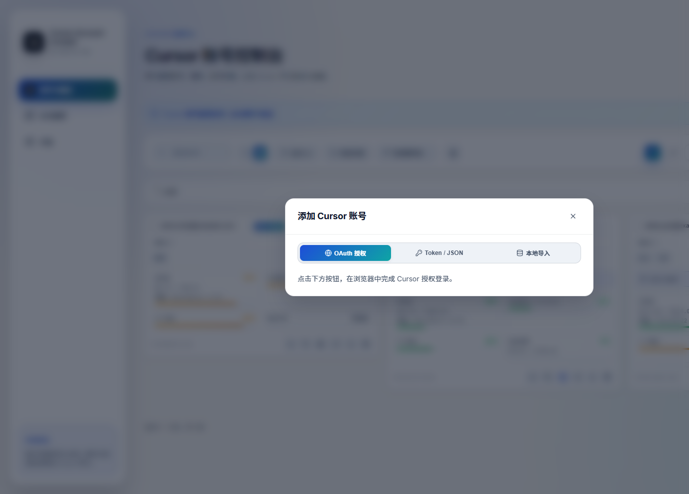
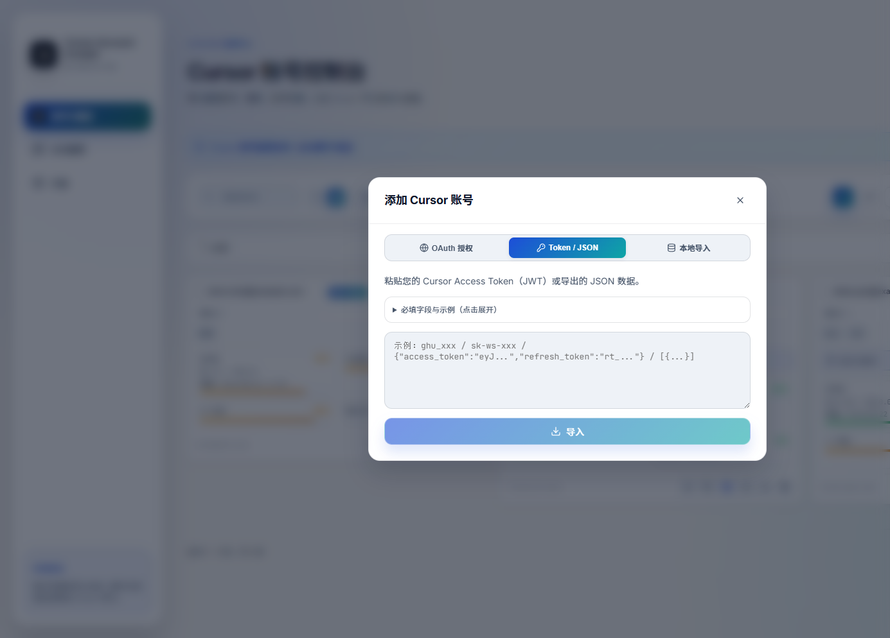
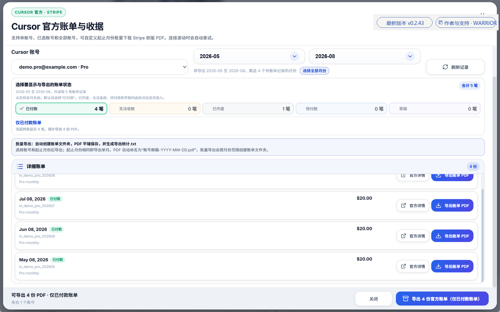
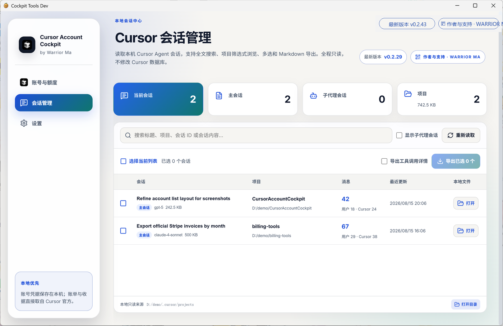

<p align="center">
  <strong>简体中文</strong> · <a href="./README.en.md">English</a>
</p>

<p align="center">
  
</p>

<h1 align="center">Cursor Account Cockpit</h1>

<p align="center">
  面向 Cursor 的本地桌面账号控制台：多账号管理、额度监控、一键切号、会话浏览，以及官方账单 / 收据导出。
</p>

<p align="center">
  <a href="https://github.com/WarriorLago/CursorAccountCockpit/releases/latest"></a>
  <a href="https://github.com/WarriorLago/CursorAccountCockpit/releases"></a>
  <a href="./LICENSE"></a>
  <a href="https://github.com/WarriorLago/CursorAccountCockpit/stargazers"></a>
</p>

<p align="center">
  <a href="https://github.com/WarriorLago/CursorAccountCockpit/releases/latest"><strong>下载 0.2.34</strong></a>
  ·
  <a href="https://github.com/WarriorLago/CursorAccountCockpit/releases">全部版本</a>
  ·
  <a href="./CHANGELOG.zh-CN.md">更新日志</a>
  ·
  <a href="./docs/SUPPORT.md">赞赏支持</a>
  ·
  <a href="https://warriorlago.github.io/CursorAccountCockpit/">项目站点</a>
  ·
  <a href="https://warriorlago.github.io/CursorAccountCockpit/features.html">功能详解</a>
</p>

<p align="center">
  
</p>

## 这是什么

Cursor Account Cockpit 是一个 **Windows 本地桌面应用**，专门服务 Cursor 多账号场景。你可以在一个窗口里：

- 集中管理多个 Cursor 账号
- 实时查看 Total / Auto / API / On-Demand 用量
- 一键切换账号并重启 Cursor
- 按月份导出官方账单与收据
- 只读浏览本机 Agent 会话并导出 Markdown

账号凭据保存在本机目录，不上传到本项目仓库。额度与账单请求直接发往 Cursor 官方域名。

## 最新版本 0.2.34

请只从本仓库官方 Release 下载（下列为直链）：

| 文件 | 说明 |
| --- | --- |
| [Cursor-Account-Cockpit-0.2.34-x64-setup.exe](https://github.com/WarriorLago/CursorAccountCockpit/releases/download/v0.2.34/Cursor-Account-Cockpit-0.2.34-x64-setup.exe) | Windows x64 安装包 |
| [Cursor-Account-Cockpit-0.2.34-portable.exe](https://github.com/WarriorLago/CursorAccountCockpit/releases/download/v0.2.34/Cursor-Account-Cockpit-0.2.34-portable.exe) | Windows x64 便携版 |
| [SHA256SUMS.txt](https://github.com/WarriorLago/CursorAccountCockpit/releases/download/v0.2.34/SHA256SUMS.txt) | SHA-256 校验 |
| [latest.json](https://github.com/WarriorLago/CursorAccountCockpit/releases/download/v0.2.34/latest.json) | 应用内更新清单 |

更多版本见 [项目下载页](https://warriorlago.github.io/CursorAccountCockpit/download.html) 或 [GitHub Releases](https://github.com/WarriorLago/CursorAccountCockpit/releases)。部分旧版本仅有源码 ZIP。

---

## 功能详解

### 1. 账号与额度总览

<p align="center">
  
</p>

<p align="center">
  
</p>

主页面支持**列表**与**卡片**两种布局。宽屏日常运维更推荐列表：邮箱、套餐、用量进度与快捷操作在同一行完整展示；卡片视图适合快速扫一眼各账号状态。

适合巡检的能力包括：

- **搜索 / 筛选 / 排序**：按邮箱、套餐、标签、创建时间快速定位
- **套餐徽章**：FREE、PRO、PRO+、ULTRA、试用等状态一目了然
- **额度可视化**：显示总用量、自动模式 + Composer、API 用量、按量付费进度条
- **账期重置时间**：鼠标悬停可看完整重置时间
- **标签与备注**：给账号打「主力 / 备用 / 工作」等标签，并写本地备注
- **批量操作**：全选、批量导出、批量删除

常用动作：切换到 Cursor、打开账单、编辑标签 / 备注、刷新配额、导出、删除。

### 2. 多种添加账号方式

<p align="center">
  
</p>

点击「添加账号」后支持三种导入路径：

| 方式 | 适合场景 |
| --- | --- |
| **OAuth 授权** | 在浏览器完成官方登录，最贴近常规登录流程 |
| **Token / JSON** | 粘贴 Access Token（JWT）或导出的 JSON，支持单条与批量 |
| **本地导入** | 读取本机 Cursor 当前登录状态，快速接入已登录账号 |

<p align="center">
  
</p>

Token / JSON 面板支持：

- 单条 JWT 直接粘贴
- JSON 对象 / 数组批量导入
- 「必填字段与示例」可展开查看格式说明

### 3. 一键切号并重启 Cursor

在账号卡片点击「切换到 Cursor」后，应用会：

1. 写入目标账号的本地认证信息
2. 关闭旧的 Cursor 进程
3. 使用设置页中的 Cursor 安装路径重新启动

这样新账号会立即生效，不必手动反复登录。

### 4. 官方账单与收据导出

<p align="center">
  
</p>

对账、月底复盘或费用分摊前，可从工具栏打开「官方账单 / 官方收据」，也可从账号行直接进入该账号的账单面板：

1. **选账号**：按需勾选一个或多个已保存账号（按账号隔离，避免混帐）
2. **选月份**：设置起止月份，支持跨月、跨年
3. **筛状态**：已付款、无法收款、已作废、待付款、草稿等
4. **导出 PDF**：批量下载官方账单 / 收据 PDF，默认 5 路并行（设置里可改为 1–10）
5. **导出用量 CSV**：下载用量明细，字段含模型、费用、Token、收费状态、用户 ID、团队 ID 等

导出文件全部写入你选择的本机目录；完成后会生成统计文本，便于核对成功 / 失败条数。敏感字段请勿发到公开聊天或仓库。

### 5. 本机会话管理（只读）

<p align="center">
  
</p>

「会话管理」只读读取本机 Cursor Agent 会话：

- 展示主会话 / 子代理、项目路径、消息数、模型、更新时间、本地体积
- 按标题、项目、会话 ID、对话正文全文搜索
- 可选显示子代理会话
- 多选后导出为 Markdown（可选择是否包含工具调用详情）
- 可直接打开会话目录或 transcript 根目录

该页面不会改写 Cursor 数据库、会话文件或账号凭据。

### 6. 设置：路径、托盘、语言与更新

<p align="center">
  
</p>

设置页覆盖日常运维项：

- **Cursor 启动与切号**：自动检测 / 手动选择 `Cursor.exe`，切号后按此路径重启
- **窗口与托盘**：关闭时收进托盘，或直接退出；最小化固定进托盘
- **账单导出并行数量**：1–10，默认 5
- **界面语言**：默认简体中文，可切换 English
- **应用更新**：启动检查 + 手动检查，下载后校验完整性并静默安装重启

---

## 环境要求

- Windows 10 / 11 x64
- [WebView2](https://developer.microsoft.com/microsoft-edge/webview2/)
- 开发：Node.js 20+、Rust stable

## 安装与使用

1. 从 [Releases](https://github.com/WarriorLago/CursorAccountCockpit/releases/latest) 下载安装包或便携版
2. 启动后先到「设置」确认 Cursor 安装路径
3. 在「账号与额度」添加账号（OAuth / Token / 本地导入）
4. 刷新额度，需要时一键切号
5. 需要归档时再导出账单、收据或会话 Markdown

## 开发

```powershell
git clone https://github.com/WarriorLago/CursorAccountCockpit.git
cd CursorAccountCockpit
npm install
npm run typecheck
npm run tauri:dev
```

构建安装包：

```powershell
npm run build
npx tauri build --bundles nsis
```

## 数据与隐私

- 账号索引与认证信息保存在本机 `~/.cursor_account_cockpit`
- 本地导入只读取 Cursor 登录状态数据库
- 额度与账单请求发往 Cursor 官方域名
- 更新清单和安装包来自本仓库的 GitHub Releases
- 不会把账号 Token 上传到本项目仓库

## 作者与联系

由 **Warrior Ma** 持续维护。有问题或合作意向，**推荐微信联系**：

<p align="center">
  
</p>

- 微信：扫上方二维码添加
- 邮箱：[warriorlago@163.com](mailto:warriorlago@163.com)
- [GitHub 主页](https://github.com/WarriorLago)
- [项目仓库](https://github.com/WarriorLago/CursorAccountCockpit)
- [赞赏与支持说明](./docs/SUPPORT.md)

应用内「作者与支持」也可进入 GitHub、Star 与赞赏入口。

## 开源与许可

感谢 [jlcodes99/cockpit-tools](https://github.com/jlcodes99/cockpit-tools) 的开源基础。本项目在其之上继续开发，详细说明见 `NOTICE.md`。

许可协议为 **CC BY-NC-SA 4.0**：允许署名、非商业使用，以及在相同协议下分享。详见 `LICENSE`。
